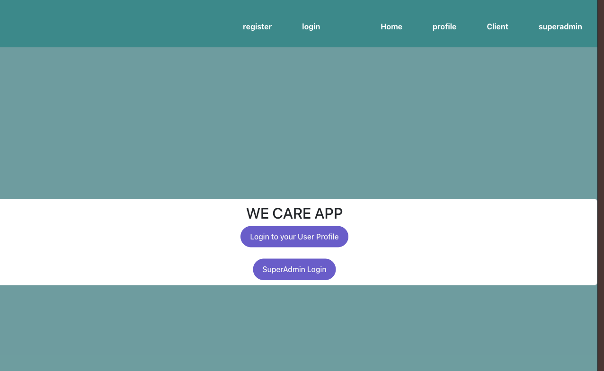
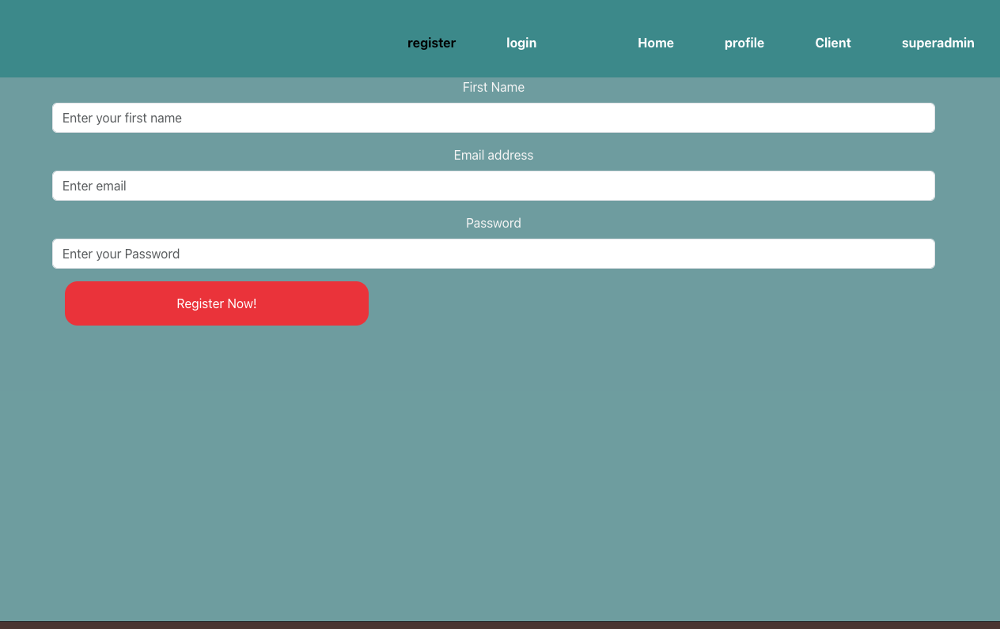
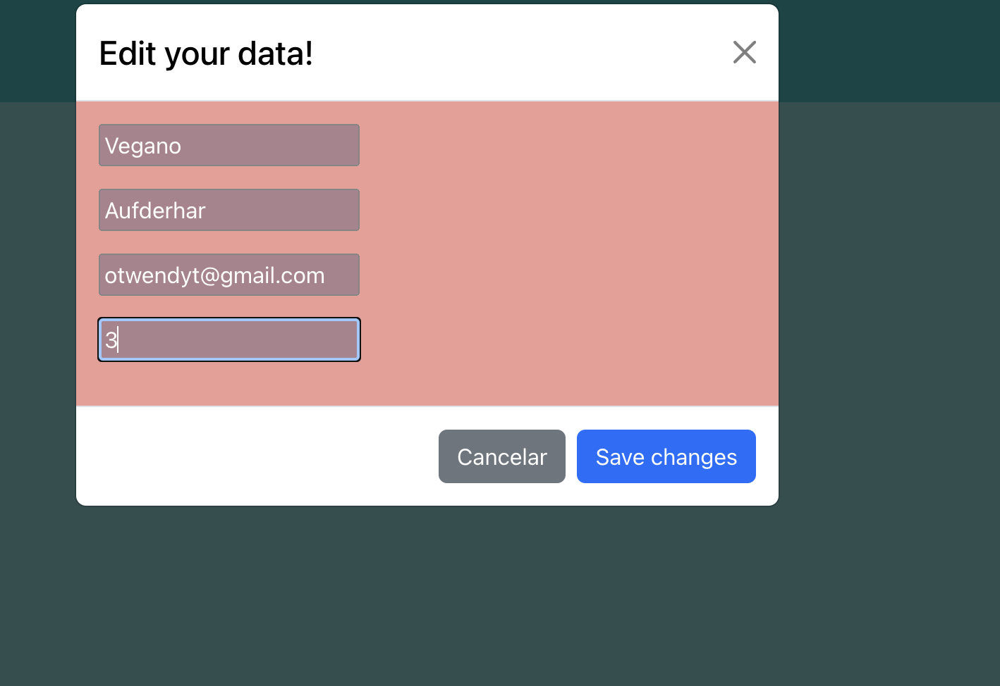
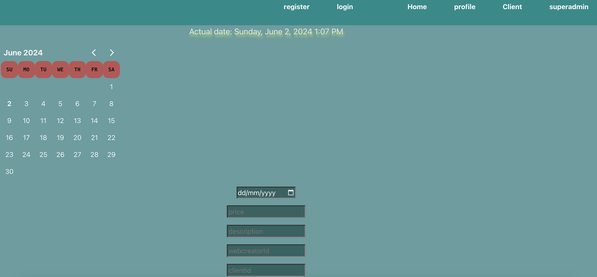
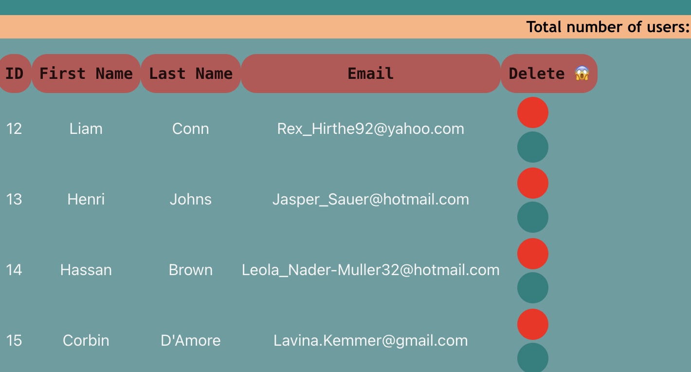

# Frontend WeCareApp 

  
Content

  <ol>
    <li><a href="#stack">Stack</a></li>
    <li><a href="#objective-">Objective</a></li>
    <li><a href="#about-the-project-🔎">About the project</a></li>
    <li><a href="#views">Views</a></li>
    <li><a href="#installation">Installation</a></li>
    <li><a href="#webgrafia">Webgrafia</a></li>
    <li><a href="#licence">Licence</a></li>
   <li><a href="#contacto">Contact</a></li>
  </ol>

## Stack

Used technologies:

 

## Objective

In the following project I have built the frontend of an NGO Mobile First App and connecting together  with  WeCareApp backend. 

 It has been done as practical experience with react js. and redux as tools, 

## About the project

The aim of this project has been to create the  visual part based for an already created relational database with different endpoints, the user and superadministrator views.
 The  development of the ONG WeCareApp includes the ability from a client = Customer  to be capable of   Register, Log in/ log out but also They can  view their profile an personal data to update it. There are three different users the superadmin, the user (client) and the webcreator.

As an extra:

\*\* The view of all existing users/services and appointments on the platform (as superadmin).

\*\* Edit and delete external data (as superadmin).

## Views

Some of the views can be seen below:

### Home

### Register

### Profile

### ONG appointments/ wecreatror

## ADMIN views

## Installation

The project is made up of both backend and frontend, so it will be necessary to install both parts.

The database can be found at the following link:

 <a href="https://github.com/Maricode-40/weCareAppBackend"> Database in here! </a>

You can follow the steps below:

1. Clone the repository `git clone`
2. Install the dependencies `$ npm install` `
3. Connect our repository to the database docker images- mysql2.
4. Execute the migrations & Run the seeders. 
  
5. New dependencies: `react-redux ` `redux-persist ` ● `redux-thunk `
   ` reduxjs/toolkit` Install all of them via your Node package Manager.
6. Connect the server`$ npm run dev`
7. <a href="https://github.com/Maricode-40/weCareAppBackend"> Check Backend in full </a>

</a>

As for the frontend, the steps are as follows:

1. Clone the repository
2. `$ npm install`
3. `$ npm run dev`
4. Here you can find below the sample of users as client and superadmin so you can login into the home view page.

client email: 

superadmin email: 

## Vercel Deploy

<a href= "#" > FRONT END DEPLOYMENT </a>

---

## Future Improvements 
 (Any suggestions, I´m already looking forward to it,  thanks)

1.- Implement a search input for the SuperAdministrator  and  optimised code.

2.- Pagination for the appointments and users.

3.- I will install Cypress to run some testings on the Frontend side.

4.- A bit more of CSS 

## Licence

This project is under MIT licence.

## Webgrafia:

<a href="https://www.npmjs.com/package/react" target="_blank"> NPM React </a>

<a href="https://react-bootstrap.netlify.app/" target="_blank"> ReactBoostrap </a>

<a href="https://jwt.io/" target="_blank"> Documentación Json Web Token</a>

<a href="https://fakerjs.dev/" target="_blank"> Faker Data Generator </a>

## Contact 👩🏽‍💻

